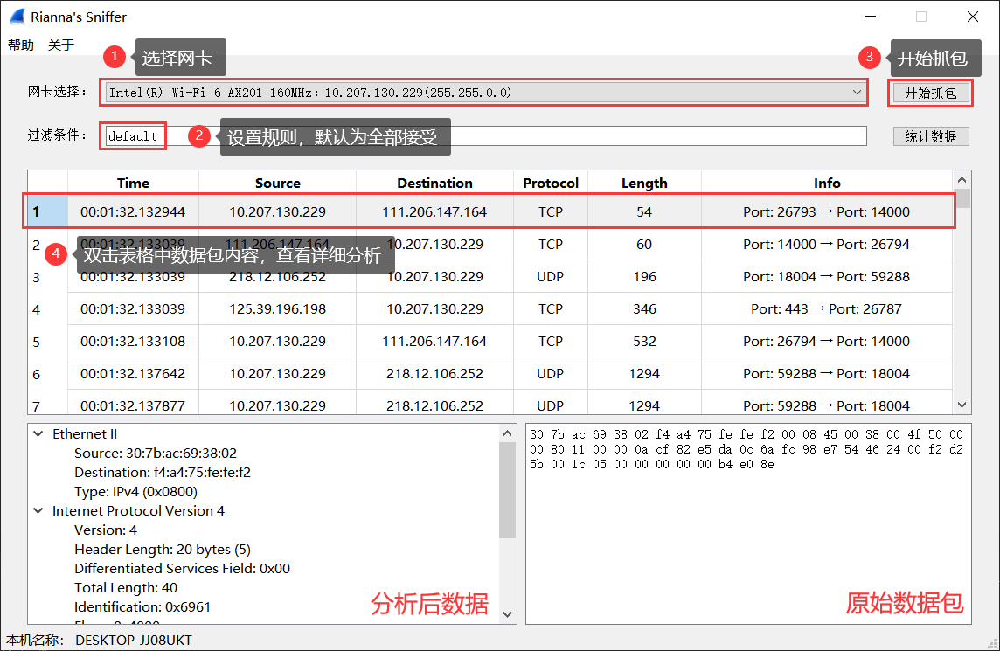

# MySniffer
MySniffer是一个基于Winpcap开发的以太网上的数据包嗅探工具，使用C++完成，GUI通过Qt5实现。

***这是中国科学院大学(UCAS-SCS)网络攻防基础实验1A的作业，抄袭后果自负***
&emsp;
## 功能
1. 搜索网卡，并选择指定的网卡进行抓包。
2. 根据BPF规则设置数据包过滤器。
3. 捕捉以太网上的多种数据包：
	- ARP数据包
	- IPv4数据包
		- TCPv4数据包
		- UDPv4数据包
		- ICMPv4数据包
	- IPv6数据包
		- TCPv6数据包
		- UDPv6数据包
		- ICMPv6数据包
4. 查看分析后的数据包内容和原始十六进制的数据包。
5. 统计捕获到的数据包数量。
&emsp;

## 文件内容
#### lib
包含使用Winpcap编程所需的库文件。
#### res
包含GUI页面使用到的图片素材
#### 其余
配置QT的`.pro`文件，设计窗口的`.ui`文件，以及众多`.h`文件和`.cpp`文件。
&emsp;&emsp;

## 使用方法

- **选择网卡**

  

- **捕获并分析数据包**

  

- **统计数据包数量**

  

- **相关内容**

  

  
